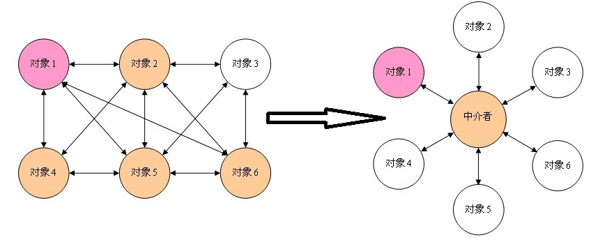
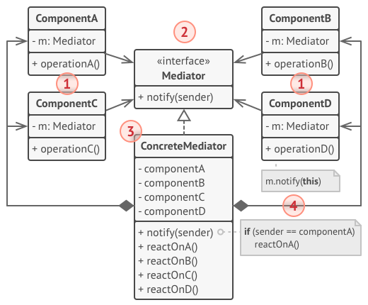

# 1 中介者模式（Mediator pattern）
**中介者模式定义**：（对象行为型模式）用一个中介对象来封装一系列的对象交互。中介者使个各对象不需要显示的引用，从而使其耦合松散，而且可以独立地改变它们之间的交互。

# 2 目标问题
&emsp;&emsp;在面向对象编程的过程中，鼓励将行为和对象进行绑定。这也导致了对象之间存在过多的连接。在最坏地情况之下，每个对象均知道其余地对象，这是十分糟糕的。并且随着对象代码和不同对象之间的耦合，想要复用对象也会变的十分的困难。

# 3 解决方法
&emsp;&emsp;通过设置一个中介者类，来和多个对象之间进行沟通控制，所有对象仅仅和中介者对象进行沟通即可。中介者可以将所有对象进行解耦。
&emsp;&emsp;类似于交易市场中的一个中间商，卖家和买家都不需要互相沟通，只需要通过中间商进行协调，这也导致了中间商赚差价，体现在程序中就是效率的损失。随着对象越来越多的话，中间商的地位过于重要。一旦中间商出现问题，整个市场就会崩溃，在代码中体现就是中介者一旦出现问题，系统就会受到较大影响

# 4 所有类之间的关系

1. ComponentC :和中介者进行沟通的各种对象
2. Mediator 接口：中介者接口，用来和各对象通信的接口
3. ConcreteMediator 对象：中介者，通过该对象和所有其余对象进行通信和控制
   - 封装了各个组件之间的关系
4. 组件之间不会知道其余组件，仅仅会通过中介者进行通信和沟通

# 5 代码实现
本节代码例子见文章末尾，我对其进行了注释：
```go
// CD 对象
type CDDriver struct {
	Data string
}

// Ⅰ ：CD 先获取数据，然后通知中介者
func (c *CDDriver) ReadData() {
	c.Data = "music,image"

	fmt.Printf("CDDriver: reading data %s\n", c.Data)
	GetMediatorInstance().changed(c)
}

// CPU 对象
type CPU struct {
	Video string
	Sound string
}

// Ⅲ ：CUP 对数据进行处理，并接着通知中介者
func (c *CPU) Process(data string) {
	sp := strings.Split(data, ",")
	c.Sound = sp[0]
	c.Video = sp[1]

	fmt.Printf("CPU: split data with Sound %s, Video %s\n", c.Sound, c.Video)
	GetMediatorInstance().changed(c)
}

// Sound 对象
type SoundCard struct {
	Data string
}

// Ⅴ ：收到中介者传来的数据，播放声音
func (s *SoundCard) Play(data string) {
	s.Data = data
	fmt.Printf("SoundCard: play %s\n", s.Data)
	GetMediatorInstance().changed(s)
}

// Video 对象
type VideoCard struct {
	Data string
}

// Ⅵ ：收到中介者传来的数据，播放画面
func (v *VideoCard) Display(data string) {
	v.Data = data
	fmt.Printf("VideoCard: display %s\n", v.Data)
	GetMediatorInstance().changed(v)
}

// 中介者对象，里面保存了四个对象的指针
type Mediator struct {
	CD    *CDDriver
	CPU   *CPU
	Video *VideoCard
	Sound *SoundCard
}

// 程序中的中介者
var mediator *Mediator

// 使用单例模式实现中介者
func GetMediatorInstance() *Mediator {
	if mediator == nil {
		mediator = &Mediator{}
	}
	return mediator
}

// 通过这个接口来控制所有对象
func (m *Mediator) changed(i interface{}) {
	switch inst := i.(type) {
    case *CDDriver:
        // Ⅱ ：中介者收到 CD 消息，通知 CPU 进行处理
		m.CPU.Process(inst.Data)
    case *CPU:
        // Ⅳ ：中介者收到 CPU 的消息，分别通知 Sound 和 Video 对象播放视频
		m.Sound.Play(inst.Sound)
		m.Video.Display(inst.Video)
	}
}

// 测试逻辑如下：
func main() {
    // 建立整个系统对象之间的关系
	mediator := GetMediatorInstance()
	mediator.CD = &CDDriver{}
	mediator.CPU = &CPU{}
	mediator.Video = &VideoCard{}
	mediator.Sound = &SoundCard{}

	// 触发整个操作
	mediator.CD.ReadData()
}
```
打印结果如下：


# 6 应用场景
- 当一些对象由于和别的对象强耦合导致不能很好的进行修改或者复用时，可以使用中介者模式进行解耦合
- 想定制一个分布在多个类中的行为，而又不想生成过多的子类
- 当创建了大量的组件子类时，可以使用中介者模式，以便在各种情况下重用一些基本行为

# 7 优缺点
## 7.1 优点
- 单一责任原则：可以将各个组件之间的通信和控制放在中介者独享中进行管理，从而更易于理解和维护
- 开放/封闭原则：可以引入新的中介者，而不许需要修改实际的组件
- 可以减少各个组件之间的耦合程度
- 可以轻松重用单个组件

## 7.2 缺点
- 中介者模式中，中介者角色承担了较多的责任，所以一旦这个中介者对象出现了问题，整个系统将会受到重大的影响
- 新增加一个同事类时，不得不去修改抽象中介者类和具体中介者类，此时可以使用观察者模式和状态模式来解决这个问题

# 8 相关模式
- 装饰模式和中介者模式的区别在于：装饰模式仅仅修饰多个子系统并进行抽象，这也导致了了，仅可已由 Facade 对子系统发送请求。但是中介者模式可以实现多向请求的实现
- 对象可以使用观察者模式和中介者对象进行通信
- 中介者对象可以使用单例模式进行实现

# 9 reference
《设计模式》-中介者模式
[design-patterns:mediator pattern](https://refactoring.guru/design-patterns/mediator)