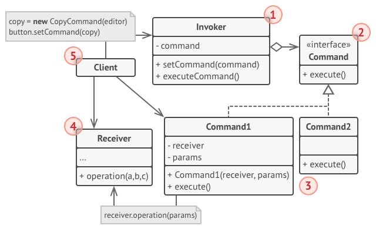

# 1 命令模式（Command pattern）
**命令模式定义**：（对象行为型模式）将一个请求封装为一个包含该请求所有信息的独立的对象，从而使你可用不同的请求对客户进行参数化，对请求排队或记录请求日志，以及支持可撤销的操作。

# 2 目标问题
&emsp;&emsp;在软件设计中，我们经常需要向某些对象发送任务请求，但是往往并不知道请求的接收者是谁，也不知道被请求的任务是哪个。我们只需在程序运行时将任务请求和具体的任务接收者关联起来即可。此时，可以使用命令模式来进行设计，使得请求发送者与请求接收者消除彼此之间的耦合，让对象之间的调用关系更加灵活。

# 3 解决方法
&emsp;&emsp;将不同命令封装成对应的命令对象，在通过该命令对象直接调用关联起来的接收者对象来处理这个任务即可。命令模式可以对发送者和接收者完全解耦，发送者与接收者之间没有直接引用关系，发送请求的对象只需要知道如何发送请求，而不必知道如何完成请求。

# 4 所有类之间的关系

1. Invoke 类：用来发起一个请求
2. Command 接口：声明执行操作的接口
3. ConcreteCommand 类：实现各种请求，将一个接收者对象绑定一个动作，调用接收者相应的操作，以实现 Execute
4. Recriver：直到如何实施与执行一个请求的相关操作。任何类都可能作为一个接收者
5. Client：创建一个具体的命令并指定它的接收者

# 5 代码实现
```go
// 命令执行的接口
type Command interface {
	Execute()
}
// 用来实现请求 A
type CommandA struct {
	mb *Parents
}
// 创建 A 对象的工厂函数
func NewCommandA(mb *Parents) *CommandA {
	return &CommandA{
		mb: mb,
	}
}
// 执行 Execute 来调用具体的接收的处理逻辑
func (c *CommandA) Execute() {
	c.mb.Acommand()
}
// 用来实现请求 B
type CommandB struct {
	mb *Parents
}
// 创建 B 对象的工厂函数
func NewCommandB(mb *Parents) *CommandB {
	return &CommandB{
		mb: mb,
	}
}
// 执行 Execute 来调用具体的接收的处理逻辑
func (c *CommandB) Execute() {
	c.mb.Bcommand()
}
// 具体的接收者
type Parents struct{}
// 具体接收者收到命令需要执行的操作
func (*Parents) Acommand() {
	fmt.Print("push A button execute command A\n")
}

func (*Parents) Bcommand() {
	fmt.Print("push B button execute command B\n")
}
// 盒子对象，有两个按钮
type Box struct {
	buttion1 Command
	buttion2 Command
}

func NewBox(buttion1, buttion2 Command) *Box {
	return &Box{
		buttion1: buttion1,
		buttion2: buttion2,
	}
}
// 按下对应的按钮触发操作
func (b *Box) PressButtion1() {
	b.buttion1.Execute()
}

func (b *Box) PressButtion2() {
	b.buttion2.Execute()
}
// 用户逻辑如下
func main() {
    // 创建命令接收者
    mb := &Parents{}
    // 两个命令，关联起来命令和接收者
	commandA := NewCommandA(mb)
	commandB := NewCommandB(mb)
    // 发送命令
	box1 := NewBox(commandA, commandB)
	box1.PressButtion1()
	box1.PressButtion2()

	box2 := NewBox(commandB, commandA)
	box2.PressButtion1()
	box2.PressButtion2()
}
```
运行结果如下：


# 6 应用场景
- 系统需要将请求调用者和请求接收者解耦，使得调用者和接收者不直接交互。
- 系统需要在不同的时间指定请求、将请求排队和执行请求。
- 系统需要支持命令的撤销操作和恢复操作。
- 系统需要将一组操作组合在一起，即支持宏命令

# 7 优缺点

## 7.1 优点
- 将调用操作的对象与知道如何实现该操作的对象解耦
- Command 是头等的对象，它们可以像其他的对象一样被操作和扩展
- 可以将多个命令装配成一个组合命令
- 增加新的 Command 十分简单，并不需要修改现有的类
- Command 可以实现撤销和恢复操作

## 7.2 缺点
- 需要在发送者和接收者之间引入一个全新的层，增加代码的复杂性

# 8 相关模式
- 职责链中的处理程序可以实现为命令。在这种情况下，可以在请求表示的同一上下文对象上执行许多不同的操作
- 当用户需要将命令的副本保存到历史记录中时，可以使用原型模式

# 9 reference
1. 《设计模式》-命令模式
2. [design-patterns:command pattern](https://refactoring.guru/design-patterns/command)
