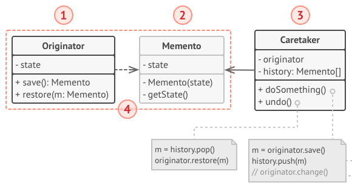

# 1 备忘录模式（Memento pattern）
**备忘录模式定义**：（对象行为型模式）再不破坏封装性的前提下，捕获一个对象的内部状态，并在该对象之外保存这个状态。这样以后就可将该对象恢复到原先保存的状态。

# 2 目标问题
&emsp;&emsp;在某些系统中需要用户对一些操作进行撤销，或是从错误中进行恢复，需要实现检查点和取消机制。其实就是虚拟机中的快照功能。可以将对象的状态保存起来，在需要时进行回退既可以完成这些操作。
&emsp;&emsp;在编辑文档的过程总，大家总是习惯使用 ctrl+z 来进行操作回退。该操作既可以使用备忘录模式来进行实现，但需要注意的是，在程序中，是不能直接保存对象的字段来进行保存对象状态的。一个对象并不是所有字段均会对外展示的，会存在私有对象，这就需要使用备忘录模式来进行状态的保存。

# 3 解决方法
&emsp;&emsp;备忘录模式通过将快照的生成操作交给原始对象自己完成，并通过备忘录对象进行备份数据的存储。可以让原始对象自己管理它生成的备忘录对象，这样别的对象就不可以操作其余对象产生的状态快照。其他对象必须使用特定的接口(窄接口)与备忘录进行通信，该接口可能允许获取快照的元数据（创建时间，已执行操作的名称等），而不是快照中包含的原始对象的状态信息。

# 4 所有类之间的关系

1. Originator 对象：原始对象
   - 可以创建一个备忘录，用来记录它自身当前的状态
   - 使用备忘录来恢复自身状态
2. Memento 对象：备忘录对象
   - 用来存储原始对象内部的状态，原始对象根据自己的需要决定存储什么多少状态
   - 防止原始对象以外的对象访问备忘录，提供两种程度的接口。备忘录管理者使用权限较低的接口，只能操作备忘录不能操作里面的状态。原始对象可以使用权限较高的接口，可以访问里面的状态。
3. Caretaker 对象：管理者对象
   - 负责保存备忘录
   - 不能对备忘录的内容进行读取和操作

# 5 代码实现
```go
// 复杂接口，这里并没有实现
type Memento interface{}
// 简单接口，给管理器使用的接口
type MementoSimple interface {
	Copy() MementoSimple
}
// 原始对象
type User struct {
	id    int
	state string
}
// 修改原始对象状态
func (u *User) ChangeState(s string) {
	u.state = s
}
// 产生备忘录
func (u *User) SaveMemento() *UserMemento {
	return &UserMemento{
		state: u.state,
	}
}
// 加载备忘录
func (u *User) LoadMemento(m *UserMemento) {
	u.state = m.state
}

func (u *User) PrintState() {
	fmt.Printf("User: %d state : %s\n", u.id, u.state)
}
// 备忘录对象
type UserMemento struct {
	state string
}
// mementosimple 接口实现
func (obj *UserMemento) Copy() MementoSimple {
	return &UserMemento{
		state: obj.state,
	}
}

// 备忘录管理类
type Caretaker struct {
	mementoMap map[int]MementoSimple
}
// 保存备忘录
func (c *Caretaker) SaveMemento(i int, m MementoSimple) {
	c.mementoMap[i] = m
}
// 获取备忘录
func (c *Caretaker) GetMemento(i int) MementoSimple {
	return c.mementoMap[i]
}
// 测试逻辑
func main() {
    // 原始对象
	user := User{
		id:    1,
		state: "old state",
    }
    // 备忘录管理器
	caretaker := Caretaker{
		mementoMap: map[int]MementoSimple{},
	}
	fmt.Println("user id: ", user.id, " state: ", user.state)
    // 生成一个备忘录
	oldState := user.SaveMemento()
	caretaker.SaveMemento(user.id, oldState)
    // 修改原始对象
	user.ChangeState("new state")
	fmt.Println("user id: ", user.id, " state: ", user.state)
    // 从 Caretaker 获取旧的对象
    oldState = caretaker.GetMemento(user.id).(*UserMemento)
    // 恢复旧的状态
	user.LoadMemento(oldState)
	fmt.Println("user id: ", user.id, " state: ", user.state)
}

```
打印结果如下：


# 6 应用场景
- 需要保存一个对象在某个时刻的状态（部分），这样可以用来后面的取消和恢复操作。
- 如果一个接口让其他对象直接得到这个状态，将会暴露对象的实现细节并破坏对象的封装性。

# 7 优缺点
## 7.1 优点
- 可以生成对象状态的快照而不会破坏其封装性
- 可以通过让看管人维护始发者状态的历史记录来简化始发者的代码

## 7.2 缺点
- 如果客户端频繁创建备忘录，则该应用程序可能会消耗大量RAM
- 备忘录管理对象需要跟踪备忘录的生命周期，以便会销毁这个备忘录对象

# 8 相关模式
- 命令模式可以使用备忘录来为可撤销的操作维护状态
- 备忘录可以使用迭代器进行迭代

# 9 reference
《设计模式》-备忘录模式
[design-patterns:memento pattern](https://refactoring.guru/design-patterns/memento)